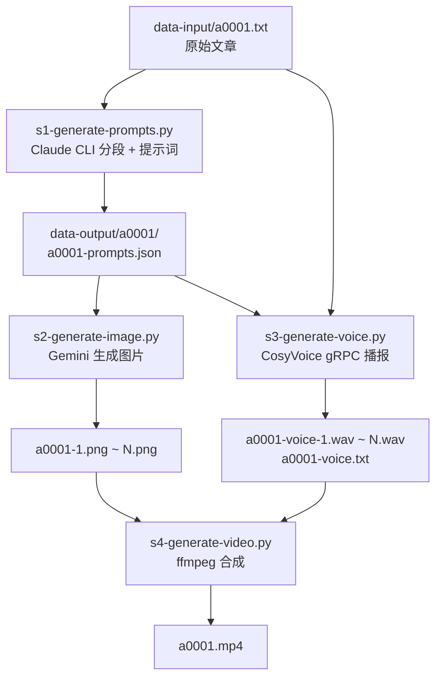

# D01 — 文章插图视频生成管线 · 总计划

> 首要依据：[idea.txt](file:///home/xs/projects/health_blog/idea.txt)

---

## 一、现有文件与 idea.txt 冲突清单

下表列出所有与 `idea.txt` 新方向冲突的旧文件及处理方案：

| # | 文件 | 冲突说明 | 处理方案 |
|---|------|----------|----------|
| 1 | [main.py](file:///home/xs/projects/health_blog/main.py) (923行) | 整个文件是「新闻简报视频生成器」，与新方向完全不同 | **归档**到 `_archive/` |
| 2 | [config/config.yaml](file:///home/xs/projects/health_blog/config/config.yaml) | 新闻简报配置（news/tts:EdgeTTS/youtube），无一项符合新方向 | **重写**为新配置 |
| 3 | [config/config.example.yaml](file:///home/xs/projects/health_blog/config/config.example.yaml) | 同上，旧配置模板 | **重写**为新配置模板 |
| 4 | [config/youtube_credentials.json](file:///home/xs/projects/health_blog/config/youtube_credentials.json) | YouTube 上传凭据，新方向无 YouTube 功能 | **归档**到 `_archive/` |
| 5 | [config/token.json](file:///home/xs/projects/health_blog/config/token.json) | YouTube OAuth token | **归档**到 `_archive/` |
| 6 | [docs/youtube_api_setup.md](file:///home/xs/projects/health_blog/docs/youtube_api_setup.md) | YouTube API 配置文档，新方向不需要 | **归档**到 `_archive/` |
| 7 | [docs/vertex_ai_setup.md](file:///home/xs/projects/health_blog/docs/vertex_ai_setup.md) | Vertex AI/Imagen 配置文档，新方向用 Gemini API 即可 | **归档**到 `_archive/` |
| 8 | [.env.example](file:///home/xs/projects/health_blog/.env.example) | 缺少 CosyVoice 相关配置 | **更新**适配新方向 |
| 9 | [.env](file:///home/xs/projects/health_blog/.env) | `GEMINI_API_KEY` 保留可用，其他需补充 | **更新**，保留 API Key |

> **不冲突，保留的文件：**
> - [docs/gemini_api_setup.md](file:///home/xs/projects/health_blog/docs/gemini_api_setup.md) — Gemini API 配置仍适用
> - [config/peaceful-spring-music-*.json](file:///home/xs/projects/health_blog/config/) — GCP 服务账号凭据，保留备用
> - `data-input/a0001.txt` — 测试文章
> - `data-output/` — 输出目录

---

## 二、系统环境确认

| 项目 | 状态 |
|------|------|
| GPU | ✅ NVIDIA RTX 4060 8GB |
| Python | ✅ 3.12.2 |
| ffmpeg | ✅ 6.1 |
| claude CLI | ✅ v2.1.59 |
| gemini CLI | ✅ 已安装 |
| CosyVoice | ❌ **尚未安装**，需部署到 `/opt/CosyVoice` |
| conda | ✅ 可用（已有多个环境） |

---

## 三、核心流程（严格按 idea.txt）



---

## 四、文件命名规则（idea.txt 第4点，统一 `a0001` 无横杠）

```
data-input/
  a0001.txt                         ← 原始文章

data-output/
  a0001/
    a0001-prompts.json              ← 分段 + 图片提示词 + 情绪提示词
    a0001-1.png                     ← 第1张配图
    a0001-2.png                     ← 第2张配图
    ...
    a0001-voice.txt                 ← 带情绪提示词的完整播报文本
    a0001-voice-1.wav               ← 第1段音频（按 segment 分段）
    a0001-voice-2.wav               ← 第2段音频
    ...
    a0001-voice.wav                 ← 合并后完整音频
    a0001.mp4                       ← 最终视频
    s1-generate-prompts.log         ← 步骤1日志
    s2-generate-image.log           ← 步骤2日志
    s3-generate-voice.log           ← 步骤3日志
    s4-generate-video.log           ← 步骤4日志
```

---

## 五、脚本命名规则（idea.txt 第5点）

```
scripts/
  s1-generate-prompts.py            ← 调用 claude cli，分段 + 生成提示词
  s2-generate-image.py              ← 调用 gemini api/cli，生成配图
  s3-generate-voice.py              ← 调用 CosyVoice gRPC 服务，生成音频
  s4-generate-video.py              ← 调用 ffmpeg，合成视频
  run.py                            ← 总控脚本，逐步执行，检查日志
```

---

## 六、各步骤详细设计

### 步骤 S1：分段 + 提示词生成

- **输入**: `data-input/a0001.txt`
- **工具**: `claude` CLI
- **输出**: `data-output/a0001/a0001-prompts.json`

输出 JSON 格式：
```json
{
  "article_id": "a0001",
  "segments": [
    {
      "id": 1,
      "summary": "一句话总结",
      "text": "原始段落文本",
      "emotion": "好奇/幽默/严肃/...",
      "image_prompt": "针对 gemini-3.1-flash-image-preview 优化的16:9提示词"
    }
  ],
  "overall_emotion": "整体情绪"
}
```

### 步骤 S2：图片生成

- **输入**: `a0001-prompts.json` 中的 `image_prompt`
- **工具**: Gemini API（`google-genai` SDK），模型 `gemini-3.1-flash-image-preview`
- **输出**: `a0001-1.png`, `a0001-2.png`, ...
- **尺寸**: 16:9（aspect_ratio 参数）
- **提示词原则**: 以图片展现主题，可包含少量关键词文字，但尽量用图片表达意思

### 步骤 S3：语音播报（CosyVoice gRPC 服务）

#### CosyVoice 资源限制与分段策略

CosyVoice 存在以下资源限制：
- 每段文本合成上限约 **100秒音频**
- 过长文本会导致 GPU OOM（RTX 4060 8GB）
- 官方推荐对长文本进行 **手动分段**

**分段方案**：复用 S1 中已划分好的 segments，每个 segment 单独合成一段音频，最后拼接：
1. 按 `a0001-prompts.json` 中的 `segments` 逐段发送到 gRPC 服务
2. 每段带上对应的 `emotion` 标注作为情绪提示词
3. 输出 `a0001-voice-1.wav`, `a0001-voice-2.wav`, ...
4. 用 ffmpeg 拼接为 `a0001-voice.wav`

#### CosyVoice 部署方案

```
部署位置: /opt/CosyVoice
运行方式: gRPC 服务（Docker 或直接运行 server.py）
本项目软链接: ln -s /opt/CosyVoice/pretrained_models ./models
模型: Fun-CosyVoice3-0.5B-2512
conda 环境: cosyvoice (Python 3.10)
gRPC 端口: 50000
```

- **输入**: 原始文章文本（按 segment 分段） + 情绪标注
- **工具**: CosyVoice gRPC 客户端（男声音色）
- **输出**:
  - `a0001-voice-1.wav` ~ `a0001-voice-N.wav` — 分段音频
  - `a0001-voice.wav` — 合并后完整音频
  - `a0001-voice.txt` — 带情绪提示词的播报文本

### 步骤 S4：视频合成

- **输入**: 配图（`a0001-1.png` ~ `N.png`） + 分段音频（`a0001-voice-1.wav` ~ `N.wav`）
- **工具**: ffmpeg
- **输出**: `a0001.mp4`
- 每张图片对应一段音频，图片展示时长 = 对应段落音频时长
- 添加淡入淡出转场效果

---

## 七、run.py 总控脚本设计（idea.txt 第6点）

```
用法: python scripts/run.py data-input/a0001.txt [--emotion 轻松幽默]

流程:
  1. 解析文章路径 → 推断 article_id (a0001)
  2. 执行 s1 → 检查 s1 log，无错误继续
  3. 执行 s2 → 检查 s2 log，无错误继续
  4. 执行 s3 → 检查 s3 log，无错误继续
  5. 执行 s4 → 检查 s4 log，完成

默认情绪: 从 a0001-prompts.json 中的 overall_emotion 提取
可通过 --emotion 参数覆盖
```

---

## 八、config.yaml 新配置结构

```yaml
# ─── 文章插图视频生成器配置 ─────────────────────

# 路径配置
paths:
  input_dir: "data-input"
  output_dir: "data-output"

# 步骤 1：文章分段 + 提示词（Claude CLI）
segmentation:
  min_segments: 5
  max_segments: 10
  claude_timeout: 300

# 步骤 2：图片生成（Gemini API）
image:
  model: "gemini-3.1-flash-image-preview"
  aspect_ratio: "16:9"
  style_prompt: |
    风格：高质量插画，清晰表达主题，色彩鲜明。
    可以包含少量关键词文字辅助表达，但尽量以图片展现主题。

# 步骤 3：语音播报（CosyVoice gRPC 本地服务）
tts:
  engine: "cosyvoice-grpc"
  grpc_host: "localhost"
  grpc_port: 50000
  model: "Fun-CosyVoice3-0.5B-2512"
  voice: "male"
  speed: 1.0
  sample_rate: 22050

# 步骤 4：视频合成（ffmpeg）
video:
  width: 1920
  height: 1080
  fps: 30
  audio_bitrate: "192k"
  transition: "fade"
  transition_duration: 0.5

# CosyVoice 服务配置（部署参考）
cosyvoice_server:
  install_dir: "/opt/CosyVoice"
  model_symlink: "./models"        # ln -s /opt/CosyVoice/pretrained_models ./models
  conda_env: "cosyvoice"
  grpc_port: 50000
```

---

## 九、依赖管理（idea.txt 第2点：venv）

项目主体使用 **venv**（s1, s2, s4 脚本）：

```
requirements.txt:
  google-genai          # Gemini API
  Pillow                # 图片处理
  PyYAML                # 配置加载
  python-dotenv         # 环境变量
  grpcio                # gRPC 客户端（连接 CosyVoice 服务）
  protobuf              # gRPC 序列化
```

CosyVoice 服务端使用独立 **conda 环境**（`cosyvoice`），安装在 `/opt/CosyVoice`，与本项目 venv 隔离。

---

## 十、执行计划（分步骤）

| 阶段 | 内容 | 预计 |
|------|------|------|
| P0 | 归档旧文件到 `_archive/`、清理冲突、创建目录结构 | 5 min |
| P1 | 创建 venv + requirements.txt + config.yaml | 5 min |
| P2 | 实现 `s1-generate-prompts.py` + 用 a0001.txt 测试 | 15 min |
| P3 | 实现 `s2-generate-image.py` + 测试图片生成 | 15 min |
| P4 | 部署 CosyVoice gRPC 到 /opt + 实现 `s3-generate-voice.py` + 测试 | 30 min |
| P5 | 实现 `s4-generate-video.py` + 测试 | 15 min |
| P6 | 实现 `run.py` 总控 + 全流程测试 | 10 min |

---

## 十一、已解决的 Questions

| 问题 | 结论 |
|------|------|
| 文件名格式 | ✅ 统一使用 `a0001`（无横杠），已同步 idea.txt |
| CosyVoice 部署位置 | ✅ `/opt/CosyVoice`，gRPC 服务形式运行，本项目 `ln -s /opt/CosyVoice/pretrained_models ./models` |
| 语音分段 | ✅ 需要分段（每段上限~100秒 + VRAM限制），复用 S1 的 segments 划分 |
| 图片提示词 | ✅ 允许少量关键词，但尽量以图片表达主题 |
| 旧文件处理 | ✅ 归档到 `_archive/` 目录 |
